# Animal Knowledge RAG Assistant

[](https://animal-knowledge-rag-bpnfy8iqoxqrbcyeasica2.streamlit.app/)
[](data/README.md)
[](requirements.txt)
[](tests/)

An end-to-end Retrieval-Augmented Generation (RAG) system built to answer animal science questions using a curated demo dataset of public research documents. It normally uses Gemini semantic retrieval and grounded generation, with a deterministic local lexical/extractive path when Gemini quota is unavailable. Both paths use deterministic citation resolution in a clean Streamlit web application.

🚀 **[Try the Live Web Application](https://animal-knowledge-rag-bpnfy8iqoxqrbcyeasica2.streamlit.app/)**

---

## Current Status & Roadmap

| # | Stage | Status | Notes |
|---|-------|--------|-------|
| 1 | Project Design | ✅ CEO Approved | System architecture & roadmap defined |
| 2 | GitHub Setup | ✅ CEO Approved | Repository foundation & baseline workflow |
| 3 | Demo Dataset | ✅ CEO Approved | 9 PDFs / 85 physical pages with manifest metadata |
| 4 | Document Ingestion | ✅ CEO Approved | Page-level raw text extraction & manifest validation |
| 5 | Text Processing & Chunking | ✅ CEO Approved | Light text normalization & page-bounded paragraph chunking |
| 6 | Embeddings | ✅ CEO Approved | 768-dim vector generation via official Google Gen AI SDK (272 chunks embedded) |
| 7 | Vector Storage | ✅ CEO Approved | FAISS IndexFlatIP 768-dim vector index & metadata mapping |
| 8 | Retrieval System | ✅ CEO Approved | Semantic Top-K context retrieval (K=4) with bounded retries & compatibility checks |
| 9 | RAG Generation | ✅ CEO Approved | Grounded answer generation via gemini-3.8-flash & controlled C1..CK source IDs |
| 10 | Citations & Grounding | ✅ CEO Approved | Source/page citation resolution & fail-closed validation |
| 11 | Web Application | ✅ CEO Approved | Streamlit web interface for grounded QA with safe citations |
| 12 | Deployment | ✅ CEO Approved | Streamlit Community Cloud public deployment & verification |
| 13 | Portfolio Integration | ✅ CEO Approved | Case study, portfolio copy, and documentation refactoring |
| 14 | Evaluation & Technical Interview Prep | 🟡 In Progress | CEO-authorized evaluation framework, retrieval metrics, & interview prep |

> **Note:** Stages 1 through 13 are fully implemented and CEO-approved with **269 automated unit tests passing**. Stage 14 — Evaluation & Technical Interview Preparation is now CEO-authorized and in progress.

---

## Key Features

- **Grounded RAG Generation:** Grounded answer generation using `gemini-3.8-flash` with low thinking level and strict context-grounding instructions.
- **768-dim Semantic Vector Storage:** Prebuilt FAISS `IndexFlatIP` storing normalized 768-dimensional `gemini-embedding-2` vectors for 272 document chunks.
- **Quota-Resilient Hybrid Runtime:** Normally uses Gemini query embeddings plus Gemini generation. If generation returns a structured provider 429, the app reuses the already retrieved semantic chunks for a deterministic extractive answer. If query embedding/retrieval returns a structured provider 429, it retrieves from the tracked metadata with deterministic local lexical ranking and produces an extractive answer without making a generation request.
- **Deterministic Citation Trust Boundary:** Model outputs controlled source IDs (`[C1]`, `[C2]`), while application code deterministically validates grammar, looks up trusted metadata, and renders inline filename/page references.
- **Fail-Closed Fallback Policy:** Emits exact fallback sentence (`"I don't have enough information in the provided sources to answer that question."`) when context is insufficient.
- **Streamlit Web Application:** Interactive interface built with Streamlit 1.64.0, form-bound submissions, source card grouping, and URL validation.
- **100% Offline Test Suite:** 269 automated unit tests covering all modules, hybrid quota orchestration, and offline Streamlit `AppTest` interface rendering.

---

## Architecture & System Flow

```mermaid
graph TD
    subgraph Offline Ingestion & Vector Indexing
        A[9 Source PDFs / data/raw/] --> B[PyMuPDF Page Extraction]
        B --> C[Page-Bounded Paragraph Chunking / 272 Chunks]
        C --> D[Gemini Embedding 2 / 768-dim]
        D --> E[L2 Normalization & FAISS IndexFlatIP]
        E --> F[Tracked Index Files / index/]
    end

    subgraph Query-Time Hybrid Execution & Citation Trust Boundary
        G[User Question] --> H[Gemini Query Embedding / gemini-embedding-2]
        H --> I[L2 Normalization]
        I --> J[FAISS Top-4 Search]
        J --> K[Ranked Context Chunks + C1..C4 IDs]
        K --> L[Gemini 3.8 Flash Generation]
        L --> M[Raw Answer with C-IDs]
        H -. Structured provider 429 .-> P[Deterministic Local Lexical Retrieval]
        P --> Q[Extractive Answer from Local Chunks]
        L -. Structured provider 429 .-> R[Extractive Answer from Semantic Chunks]
        Q --> N[Stage 10 Deterministic Citation Parser]
        R --> N
        M --> N[Stage 10 Deterministic Citation Parser]
        N --> O[Streamlit UI Rendered Answer & Source Cards]
    end
```



### Free quota fallback and hosting

At diagnosis, the configured `gemini-3.8-flash` free tier reported a daily generation allowance of **20 requests per day**. That is an observed provider limit, not a permanent project guarantee: Google can change quotas by model, project, account, or region, so check the current Google Gemini API limits for your configuration.

When a structured provider 429 indicates quota exhaustion, the fallback executes inside the deployed Streamlit Community Cloud app. It requires no Gemini generation request and does not depend on the developer's laptop remaining on. Streamlit Community Cloud's free tier can sleep when inactive, take time to wake, and enforce its own compute, memory, and availability limits.

The UI labels this mode with: *“Gemini's free limit is currently reached, so this answer was extracted directly from the indexed sources.”* Extractive answers select source sentences deterministically; they are generally less fluent and less capable of synthesis than Gemini-generated answers, and may return the exact insufficient-context fallback when local evidence does not conservatively support the question.

---

## Grounding & Citation Trust Boundary

A central trust boundary of this project is that **Gemini output is NOT authoritative citation metadata**:

1. **Controlled Identifiers:** Retrieved chunks are labeled `[C1]` through `[C4]`.
2. **Deterministic Resolution:** Stage 10 Python code (`src/citations.py`) parses bracketed markers against strict grammar rules, verifies canonical C-ID existence in the Stage 9 `source_map`, extracts filenames and physical page numbers, and renders user-facing references (e.g. `(bald_eagle_lead_exposure.pdf, p. 1)`).
3. **Fail-Closed Validation:** Malformed syntax (`[c1]`, `[C0]`, `[C1; C2]`), unknown IDs, or supported answers missing citations are immediately rejected.
4. **Entailment Limitation:** Citation provenance validation verifies syntactic marker structure, canonical ID existence, and metadata lookup integrity—it does not establish semantic entailment or guarantee factual correctness. Formal answer-quality evaluation remains planned for Stage 14.

---

## Technology Stack

- **UI Framework:** `streamlit==1.64.0` (Python 3.13)
- **LLM & Embeddings:** `google-genai==2.26.0` (`gemini-3.8-flash` & `gemini-embedding-2`)
- **Vector Database:** `faiss-cpu==1.15.1` (`IndexFlatIP` float32 768-dim)
- **PDF Extraction:** `pymupdf==1.28.2`
- **Data Processing:** `numpy==2.4.3`
- **Testing:** `unittest` + `streamlit.testing.v1.AppTest`

---

## Curated Demo Corpus

The system operates over a curated 9-document corpus combining government factsheets and peer-reviewed open-access research (85 physical pages, 272 chunks):
- `bald_eagle_factsheet.pdf`
- `bald_eagle_lead_exposure.pdf`
- `monarch_butterfly_factsheet.pdf`
- `monarch_flight_performance.pdf`
- `monarch_migration_mortality.pdf`
- `humpback_whale_foraging.pdf`
- `sea_turtle_foraging.pdf`
- `sea_turtle_nest_monitoring.pdf`
- `african_elephant_reintegration.pdf`

Full details and Creative Commons attribution are documented in [data/README.md](data/README.md) and [data/dataset_manifest.csv](data/dataset_manifest.csv).

---

## Engineering Decisions & Tradeoffs

- **Plain Python vs. Heavy Frameworks:** Using raw Python and native SDKs made control flow, error handling, and citation boundaries 100% explicit without black-box framework abstractions.
- **Exact IndexFlatIP Search:** Flat inner-product search provides exact nearest-neighbor matching for 272 vectors without quantization loss.
- **Cosine Similarity via L2 Normalization:** Document and query vectors are row-wise L2-normalized prior to search so inner product matches cosine similarity.
- **Tracked Runtime Index Artifacts:** Shipping `index/faiss.index`, `index/chunk_metadata.json`, and `index/index_manifest.json` in Git enables instant deployment on Streamlit Community Cloud without re-embedding the corpus at startup.

---

## Example RAG Execution

### Query: *"How does lead ammunition expose bald eagles to lead?"*

#### Rendered Output:
> Bald eagles scavenge remains containing lead fragments (bald_eagle_lead_exposure.pdf, p. 1).

#### Rendered Source Card:
- **Title:** *Lead Exposure in Bald Eagles from Big Game Hunting, the Continental Implications and Successful Mitigation Efforts*
- **Filename:** `bald_eagle_lead_exposure.pdf`
- **Physical Page:** `p. 1`
- **Publisher:** PLOS ONE
- **Source Document:** [🌐 View Source Document](https://journals.plos.org/plosone/article/file?id=10.1371/journal.pone.0051978&type=printable)

---

## Running Execution and Tests

### 1. Installation
Install verified dependencies:
```bash
pip install -r requirements.txt
```

### 2. Run Automated Offline Test Suite
Execute the full offline unit test suite covering Stages 4 through 11 (requires no network calls or API keys):
```bash
python -m unittest discover tests
```
*Coverage:* **269 automated unit tests passing**, including provider-quota classification, semantic and local retrieval, extractive answer construction, hybrid orchestration, citation validation, evaluation helpers, and Streamlit UI behavior.

### 3. Launch Streamlit Web Application Locally
To run the web interface locally with the normal Gemini path, set `GEMINI_API_KEY` in the process environment and keep the local `index/` directory available:
```bash
streamlit run app.py
```
*Note:* `.env.example` is a template only; application code reads `GEMINI_API_KEY` from process environment or Streamlit Cloud `st.secrets`. Once running, structured Gemini quota failures automatically use the local fallback described above; no separate fallback service or running developer laptop is required.

---

## Project Structure

```
animal-knowledge-rag/
├── app.py                  # Stage 11 Streamlit web application
├── requirements.txt        # Verified project dependencies
├── .env.example            # Environment variable template
├── .gitignore              # Git ignore rules
├── README.md               # Root documentation
├── src/
│   ├── ingestion.py        # Stage 4: Manifest validation & PDF text extraction
│   ├── processing.py       # Stage 5: Light text normalization
│   ├── chunking.py         # Stage 5: Page-bounded paragraph chunking
│   ├── embeddings.py       # Stage 6: 768-dim Gemini chunk embeddings
│   ├── vector_store.py     # Stage 7: FAISS IndexFlatIP index & metadata storage
│   ├── retrieval.py        # Stage 8: Semantic Top-K document chunk retrieval
│   ├── generation.py       # Stage 9: Gemini grounded RAG answer generation
│   ├── offline_fallback.py # Local lexical retrieval, extraction, and hybrid orchestration
│   ├── provider_errors.py  # Structured provider quota classification
│   └── citations.py        # Stage 10: Source/page citation resolution
├── docs/
│   ├── portfolio-case-study.md # Detailed Stage 13 engineering case study
│   └── portfolio-copy.md       # Reusable portfolio descriptions & resume bullets
├── data/
│   ├── dataset_manifest.csv # Approved dataset manifest (9 PDFs / 85 pages)
│   ├── README.md           # Dataset licensing, attribution, and provenance
│   ├── raw/                # Approved source PDF documents
│   └── processed/          # Intermediate extracted data (gitignored)
├── index/                  # Tracked Stage 7 runtime FAISS artifacts for cloud deployment
│   ├── faiss.index
│   ├── chunk_metadata.json
│   └── index_manifest.json
└── tests/
    ├── test_ingestion.py   # Stage 4 ingestion test suite
    ├── test_processing.py  # Stage 5 text processing test suite
    ├── test_chunking.py    # Stage 5 chunking test suite
    ├── test_embeddings.py  # Stage 6 embedding offline test suite
    ├── test_vector_store.py# Stage 7 vector storage test suite
    ├── test_retrieval.py   # Stage 8 retrieval test suite
    ├── test_generation.py  # Stage 9 generation offline test suite
    ├── test_offline_fallback.py # Local fallback and hybrid orchestration tests
    ├── test_provider_errors.py  # Provider quota classification tests
    ├── test_citations.py   # Stage 10 citation offline test suite
    └── test_app.py         # Stage 11 Streamlit/AppTest suite
```

---

## Limitations

- **Curated Corpus:** Small 9-document demo dataset (85 physical pages / 272 chunks).
- **Text-Based PDFs Only:** No OCR processing for image-only PDFs.
- **Single-Turn QA:** No conversational memory or multi-turn chat history.
- **Fixed Retrieval Baselines:** The normal path uses dense Top-4 retrieval; the quota path uses deterministic token-overlap ranking over local metadata. Neither path uses BM25 or reranking.
- **Extractive Fallback Quality:** Quota-mode answers copy a small number of conservatively selected source sentences. They can be less fluent and less complete than generated answers and do not perform broad synthesis.
- **Hosted Free-Tier Constraints:** Gemini and Streamlit free-tier quotas, sleep/wake behavior, and resource limits are controlled by their providers and can change.
- **Syntactic Citation Verification:** Citation provenance validation verifies syntactic marker structure and metadata lookup; formal semantic entailment evaluation remains planned for Stage 14.

---

## Data and Licensing Policy

This repository uses strictly public-domain and open-access Creative Commons (CC-BY 4.0) animal research documents. Dataset provenance, licensing evidence, and redistribution terms are detailed in [data/README.md](data/README.md).
